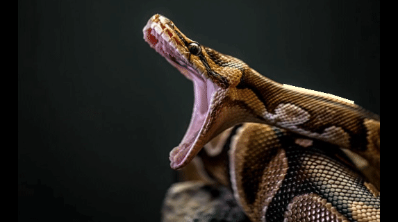

# get-stick-bugged-lol
A Python module and command-line tool that generates a 
[Get Stick Bugged Lol](https://knowyourmeme.com/memes/get-stick-bugged-lol) video from any image.

## Example
```commandline
gsbl python.jpg python.mp4 -r 760 475 -s 0.7
```


[Example video with sound](examples/python.mp4)

This script uses [pylsd-nova](https://github.com/AndranikSargsyan/pylsd-nova) to detect line segments in the image,
Pillow to draw the lines as they move to form the stick bug, and MoviePy to create the video.

## Requirements
* Python 3.6 or later (any OS)

## Installation
This package can be installed using pip:
```commandline
pip install get-stick-bugged-lol
```

## Usage
### In the terminal
Installing the package will register the `gsbl` command in the terminal (or you can use `python -m gsbl`). To use the
image `input.png` to generate the video `output.mp4`:
```commandline
gsbl input.png output.mp4
```
Optional arguments:
* `-h, --help` show this help message and exit
* `-r --resolution WIDTH HEIGHT` width and height of the video (default: 720 720)
* `--img-bg-color R G B` RGB background color while the image is visible (default: 0 0 0)
* `--line-color R G B` RGB color of line segments (default: 255 255 211)
* `--line-bg-color R G B` RGB background color after image disappears (default: 125 115 119)
* `-s --scale SCALE` the image scale passed to the line segment detector. Slightly lowering this may improve results in
large images. This does not affect the image scale in the video (try --resolution instead). (default: 0.8)

### In a Python script

```python
from PIL import Image
from gsbl.stick_bug import StickBug

# Create the StickBug object
sb = StickBug(Image.open('example.png'))  # parameter can also just be a filepath

# Change some properties if you want
sb.video_resolution = (1280, 720)
sb.lsd_scale = 0.5

# That's it! The video will be generated the first time you access it
video = sb.video  # MoviePy VideoClip

# Or you can just save it
sb.save_video('example.mp4')

# If any settings were changed, the video will be regenerated the next time you access it.
sb.line_color = (128, 0, 255)
video_purple = sb.video
```

#### `StickBug` properties
* `image` the source PIL Image. You can set this when initializing `StickBug`, or at any time by accessing the property.
If you want, you can leave this parameter empty while initializing.
* `segments` a numpy array of the 9 line segments detected. If the line segment detector hasn't run yet, that's done the
first time this is accessed. The line segment detector will run again if any other properties have changed. This can
also be set manually if you want. Each row of the array must contain the values `[x1, y1, x2, y2, width]`.
* `video` (readonly) the MoviePy VideoClip generated by the script. If the video hasn't been generated yet, that's
done the first time this is accessed. The video will be regenerated if any other properties have changed.

* `video_resolution` the resolution of the video as a tuple
* `lsd_scale` the image scale passed to the line segment detector. Slightly lowering this may improve results in large
images. This does not affect the image scale in the video.
* `img_bg_color` the background color of the video while the image is visible
* `line_color` the color of the line segments in the video
* `line_bg_color` the background color of the video after the image disappears

## Building
Install the required packages:

    pip install -r requirements.txt

Install this package directly:

    cd [path to repository]
    pip install .

Or build a wheel:

    cd [path to repository]
    python3 setup.py bdist_wheel

## License
This package is available under the MIT License. See [LICENSE](LICENSE) for more info.

This package makes use of the following external libraries:
* [pylsd-nova](https://github.com/AndranikSargsyan/pylsd-nova)
* [NumPy](https://numpy.org)
* [Pillow](https://python-pillow.org)
* [MoviePy](https://github.com/Zulko/moviepy)
